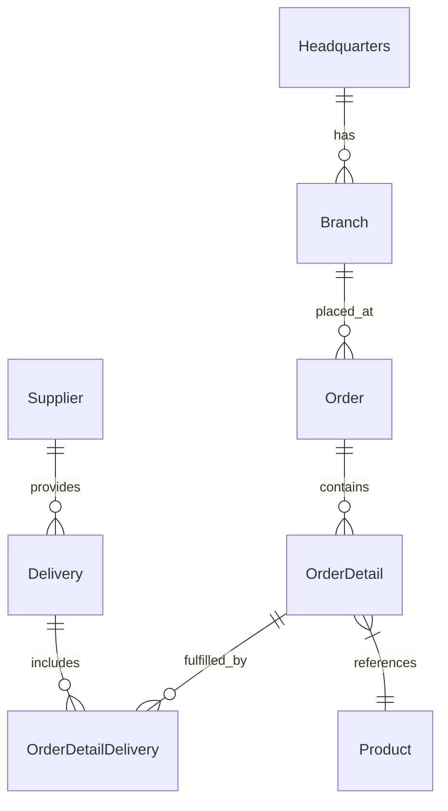

# 🚀 OctoCAT Supply: The Ultimate GitHub Copilot Demo v4.1.0


Welcome to the OctoCAT Supply Website - your go-to demo for showcasing the incredible capabilities of GitHub Copilot, GHAS, and the power of AI-assisted development!

> [!NOTE]
> For a walkthrough of all demos, check out the [Demo Walkthroughs](./demo/walkthroughs/README.md).

## 🏗️ Architecture

The application is built using modern TypeScript with a clean separation of concerns:



### Tech Stack

- **Frontend**: React 18+, TypeScript, Tailwind CSS, Vite

- **Backend**: Express.js, TypeScript, SQLite, OpenAPI/Swagger

- **Data**: SQLite (file db at `api/data/app.db`; in-memory for tests)
- **DevOps**: Docker

## 🚀 Getting Started

### Prerequisites


- Node.js 18+ and npm

- Make

### Quick Start

1. Clone this repository

2. Install dependencies:

   ```bash
   make install
   ```

3. Start the development environment:

   ```bash
   make dev
   ```

This will start both the API server (on port 3000) and the frontend development server (on port 5137).

### Available Make Commands

View all available commands:

```bash
make help
```

Key commands:

- `make dev` - Start both API and frontend development servers
- `make dev-api` - Start only the API server
- `make dev-frontend` - Start only the frontend server
- `make build` - Build both API and frontend for production
- `make db-init` - Initialize database schema
- `make db-seed` - Seed database with sample data
- `make test` - Run all tests
- `make clean` - Clean build artifacts and dependencies

### Database Management

Initialize the database explicitly (migrations + seed):

```bash
make db-init
```

Seed data only:

```bash
make db-seed
```


Or use npm scripts directly in the API directory:

```bash
cd api && npm run db:migrate  # Run migrations only
cd api && npm run db:seed     # Seed data only
```


### VS Code Integration

You can also use VS Code tasks and launch configurations:

- `Cmd/Ctrl + Shift + P` -> `Run Task` -> `Build All`
- Use the Debug panel to run `Start API & Frontend`

## ☁️ Azure Deployment

Deploy the application to Azure App Services using Terraform and source-code zip deploy (no Docker required):

### Prerequisites

- [Terraform](https://www.terraform.io/downloads) v1.11+
- [Azure CLI](https://docs.microsoft.com/en-us/cli/azure/install-azure-cli) and `az login`
- [Node.js](https://nodejs.org/) 20+

### Quick Start

```bash
# 1. Configure your deployment variables
cp infra/terraform/terraform.tfvars.example infra/terraform/terraform.tfvars
# Edit terraform.tfvars with your resource group, location, etc.

# 2. Full deploy (infrastructure + application code)
make deploy

# 3. Re-deploy code only (skip Terraform, faster iterations)
make redeploy

# 4. Tear down all Azure resources
make destroy
```

**What Gets Deployed:**
- Azure App Service Plan (Linux, Basic B1 by default)
- API App Service (Node.js/Express — built on Azure via Oryx)
- Frontend App Service (React/Vite — built on Azure via Oryx)
- Auto-configured CORS and environment variables

**Cost:** Starting at ~$18/month for dev environments (Basic B1 tier)

📖 **Documentation:**
- [Terraform README](./infra/terraform/README.md) - Complete deployment guide
- [Quick Start Guide](./infra/terraform/QUICKSTART.md) - Quick reference

## 🛠️ MCP Server Setup (Optional)

To showcase extended capabilities:

1. Install Docker/Podman for the GitHub MCP server
2. Use VS Code command palette:
   - `MCP: List servers` -> `playwright` -> `Start server`
   - `MCP: List servers` -> `github` -> `Start server`
3. Configure with a GitHub PAT (required for GitHub MCP server)

## 📚 Documentation

- [Detailed Architecture](./docs/architecture.md)
- [SQLite Integration](./docs/sqlite-integration.md)
- [Complete Demo Script](./demo/walkthroughs/README.md)

Database defaults and env vars:

- DB file: `api/data/app.db` (override with `DB_FILE=/absolute/path/to/file.db`)
- Enable WAL: `DB_ENABLE_WAL=true` (default)
- Foreign keys: `DB_FOREIGN_KEYS=true` (default)

## 🎓 Pro Tips for Solution Engineers

- Practice the demos before customer presentations
- Remember Copilot is non-deterministic - be ready to adapt
- Mix and match demo scenarios based on your audience
- Keep your GitHub PAT handy for MCP demos

---

*This entire project, including the hero image, was created using AI and GitHub Copilot! Even this README was generated by Copilot using the project documentation.* 🤖✨
