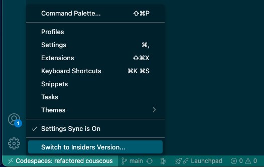

# OctoCAT Supply Chain Management - Demo Walkthroughs

Comprehensive demo environment showcasing GitHub's enterprise features using a modern TypeScript web application (React frontend + Express API) with an OctoCat Style!

## 🚀 Quick Setup

**Many demos can be shown without an IDE!** Most GitHub features (Issues, Projects, Actions, GHAS, Pull Requests) are web-based and don't require local development setup.

### For IDE-Based Demos

#### Option 1: Codespaces (Recommended)

- ✅ Zero setup - everything pre-configured
- ✅ Docker and dependencies included
- ✅ Automatic API endpoint detection for browser and local VS Code
- ❌ Some Copilot MCP demos (e.g., Playwright) won't work

#### Option 2: Local Checkout

- ✅ Full functionality including all MCP demos
- ✅ Better performance for intensive tasks
- ❌ Requires local setup (see [main README](../../README.md) for instructions)
- **Requirements**: Docker, GitHub PAT with repo permissions

### (optional) VSCode Insiders

You don't need VS Code Insiders unless demoing preview features. In Codespaces, switch via the gear icon (bottom-left) → `Switch to Insiders Version...`

## 📚 Available Walkthroughs

### 🤖 GitHub Copilot & AI Features

**File:** [copilot-in-ide.md](./copilot/copilot-in-ide.md)

Comprehensive demonstrations of GitHub Copilot's capabilities including:

- **Planning Mode**: Use Copilot Chat to plan new features
- **Mission Control**: Manage multiple Copilot Coding Agent sessions
- **Custom Agents**: Repository-specific agents like BDD Specialist
- **Copilot Code Review**: AI-assisted pull request reviews
- **Group Changes**: Copilot automatically groups related file changes in a PR
- **Copilot Spaces**: Compliance and knowledge base integration
- **TDD Agent Mode**: Multi-phase custom agent workflow using TDD as the vehicle
- **Agent Mode & Vision**: Generate cart functionality using natural language and images
- **Unit Testing**: Automated test generation and coverage improvement
- **Custom Instructions**: Personalize Copilot for internal frameworks and standards
- **MCP Servers**: Playwright testing and GitHub API integration
- **Security Analysis**: Vulnerability detection and automated fixes
- **CI/CD Generation**: Automated workflow creation with Actions and Infrastructure as Code
- **Copilot Coding Agent**: Async task handoff and parallel experimentation

### 🎯 Hooks + Skills + CLI SDK (Unified Demo)

**File:** [hooks-skills-cli-sdk.md](./copilot/hooks-skills-cli-sdk.md)

A single continuous narrative demonstrating three Copilot platform layers using one realistic feature (DeliveryVehicle):

- **Act 1 - Agent Hooks**: Audit logging and checkpoint commits for governance
- **Act 2 - Agent Skills**: Institutional knowledge applied automatically for consistency
- **Act 3 - CLI SDK Fleet**: Parallel agents for test coverage at scale

Use this walkthrough for customer presentations where you want one coherent story rather than three separate features.

### 🛠️ Agent Skills

**File:** [agent-skills.md](./copilot/agent-skills.md)

Demonstrate how Agent Skills encode specific knowledge/patterns/instructions for consistent code generation:

- **Skills Overview**: What Agent Skills are and how they work - as well as when to use Skills vs Custom Instructions
- **API Endpoint Generation**: Use the `api-endpoint` skill to add a new entity (DeliveryVehicle)
- **Pattern Adherence**: Show how generated code follows the encapsulated skill definition

### 🤖 Agentic Workflows

**File:** [agentic-workflows.md](./copilot/agentic-workflows.md)

Demonstrate AI-powered GitHub Actions workflows that reason, adapt, and act autonomously:

- **Workflow Creation**: Use CCA to "vibe-code" a new agentic workflow from scratch
- **Auto-Analyze Failures**: Automatic build failure triage, issue creation, and Copilot assignment
- **Daily Activity Summary**: Scheduled autonomous repo reporting
- **PR Doc & Test Review**: Agentic PR reviewer that enforces documentation and test coverage standards

### ✨ GitHub Spark

**File:** [spark.md](./copilot/spark.md)

Demonstrate how Product Managers can go from idea to prototype to deployed app:

- **App Creation**: Create a full-stack prototype from a natural language prompt
- **Real-Time Editing**: Point-and-edit experience for refining UI and logic
- **Rapid Prototyping**: Validate ideas early without setup friction

### 🔒 GitHub Advanced Security (GHAS)

**File:** [ghas.md](./ghas.md)

Security-focused demonstrations covering:

- **CodeQL & Code Scanning**: Detect vulnerabilities in existing code
- **Autofix**: AI-powered vulnerability remediation
- **CCA & CodeQL**: Copilot Coding Agent uses CodeQL tooling automatically
- **Assign Alerts**: Delegate security fixes to Coding Agents
- **PR Security**: Prevent vulnerable code from being merged
- **Live Vulnerability Demos**: Interactive security testing scenarios
- **Secret Scanning**: Detect exposed credentials and tokens (with extended metadata)

### 💎 Code Quality

**File:** [code-quality-demo.md](./code-quality-demo.md)

Code quality and maintenance features:

- **Enablement**: Setting up Code Quality analysis
- **Findings Review**: Analyzing code quality issues
- **Copilot Fixes**: Generating and applying fixes for quality findings
- **PR Integration**: Reviewing code quality findings in Pull Requests

### ⚙️ GitHub Actions & CI/CD

**File:** [actions.md](./actions.md)

Workflow and automation demonstrations:

- **Required Workflows**: Organization-level workflow enforcement
- **Dependency Review**: Automated security checks for dependencies
- **Reusable Workflows**: Streamline common CI/CD tasks
- **Artifact Attestations**: Create and verify build provenance and SBOMs

### 🏛️ Governance & Compliance

**File:** [governance.md](./governance.md)

Enterprise governance features:

- **AI Controls**: Manage Agent Rulesets and Copilot policies (Control Plane)
- **Repository Rulesets**: Dynamic rule enforcement based on metadata
- **Custom Properties**: Repository classification and automated policy application
- **Branch Protection**: Pull request requirements and security scanning
- **Compliance Workflows**: Required security and quality checks

### 📊 Issues & Project Management

**File:** [issues-and-projects.md](./issues-and-projects.md)

Project planning and tracking demonstrations:

- **Issue Management**: Types, dependencies, and sub-issues
- **Project Boards**: Agile workflow visualization with custom fields
- **Automations**: Built-in workflows for project item management
- **Views**: Support for Backlogs, Sprint Boards, Roadmaps, and more

### 📦 Utilities & Guides

**File:** [general-demo-overview.md](./general/general-demo-overview.md)

- **General Setup**: Building, running, and debugging the application
- **Demo Philosophy**: Why and how to demonstrate this app

**File:** [patch-sets.md](./general/patch-sets.md)

- **Patch Sets**: How to use pre-packaged changes for "fake-live" coding demos
- **Creating Patches**: Guide to creating new patch sets

## 💡 Tips for Success

- **Non-deterministic AI**: Copilot responses vary - be prepared to adapt
- **Practice**: Rehearse all scenarios before live demonstrations
- **Mix & Match**: Combine different walkthroughs based on audience needs

---

**Need help?** Each walkthrough file contains detailed step-by-step instructions and troubleshooting guidance for successful demonstrations.
