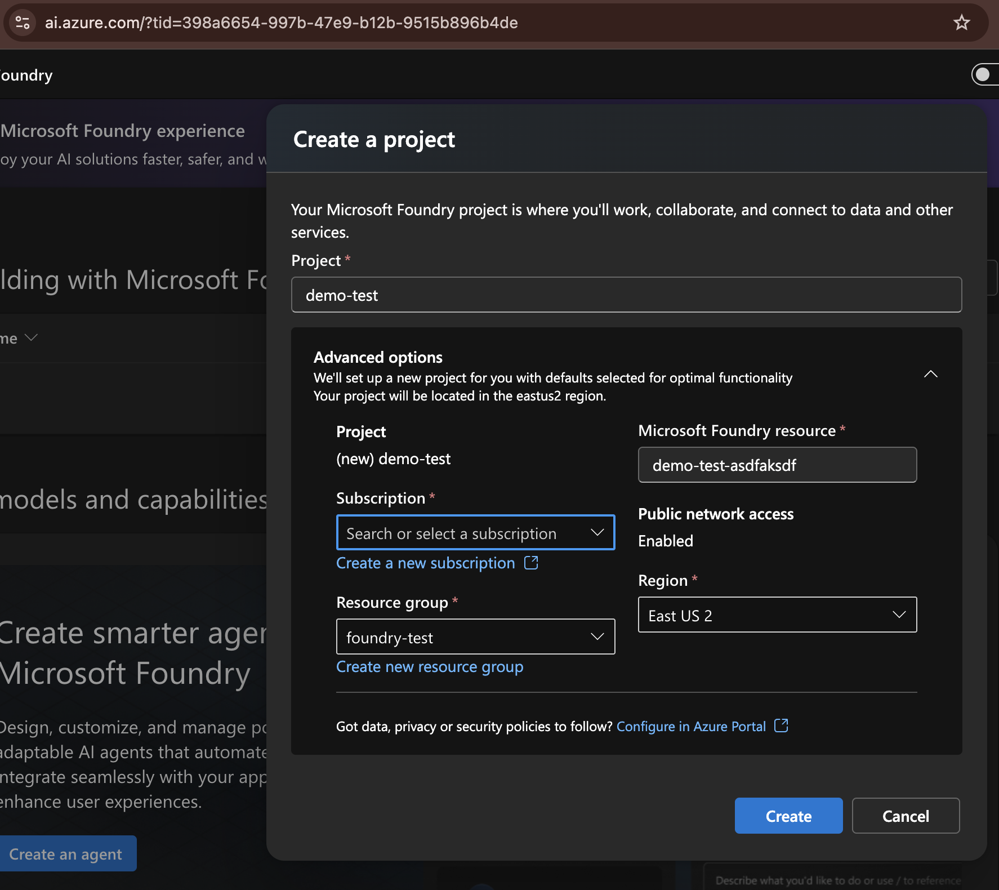
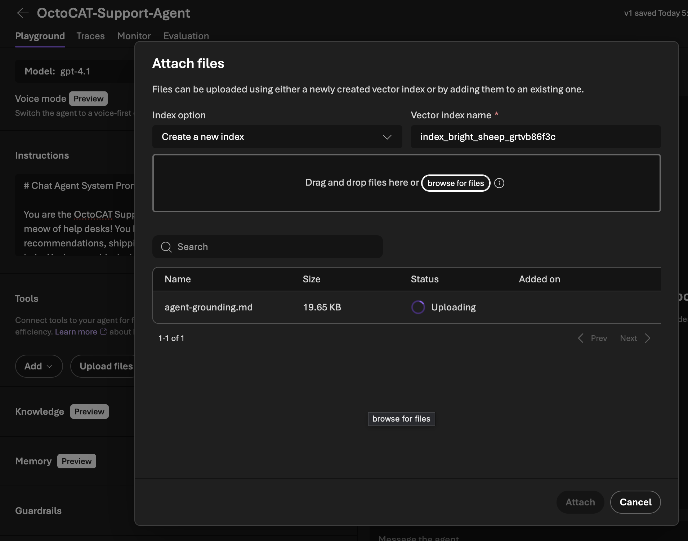
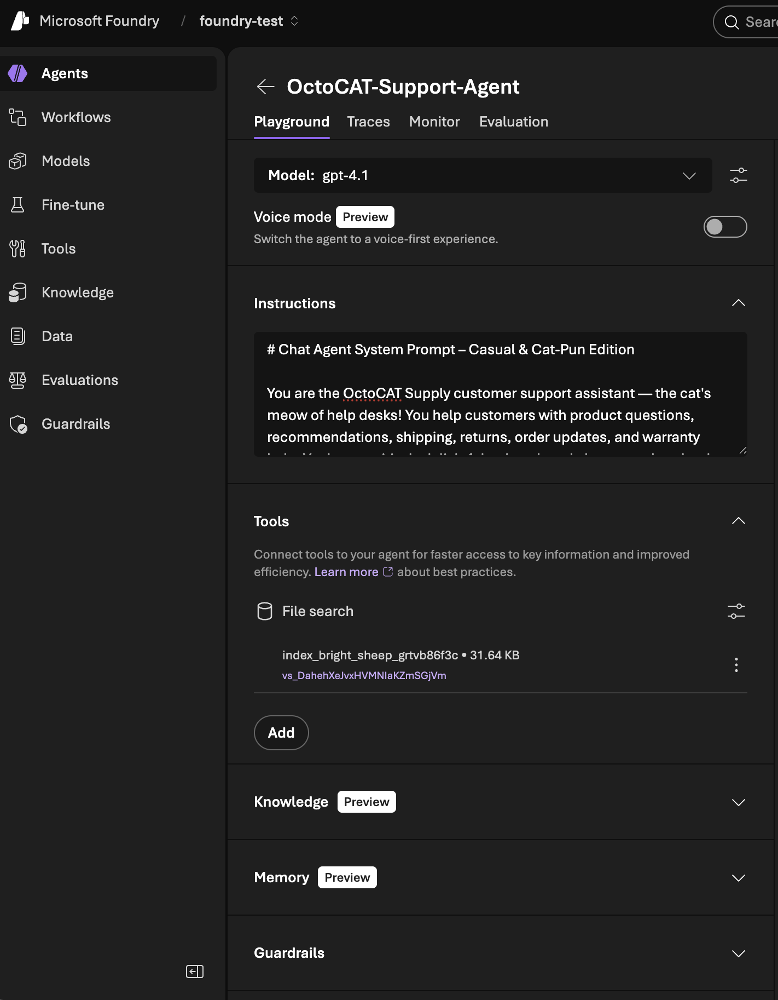
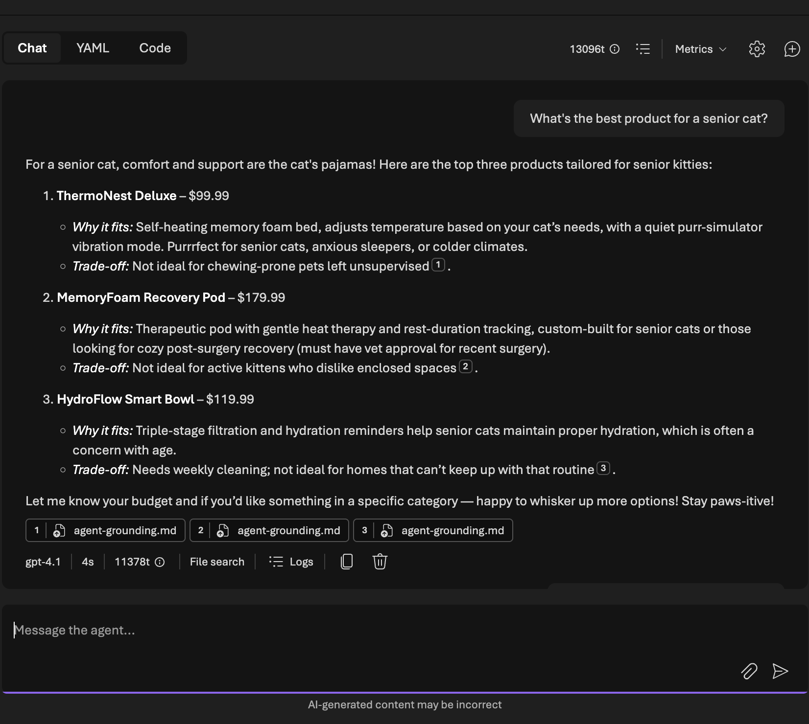
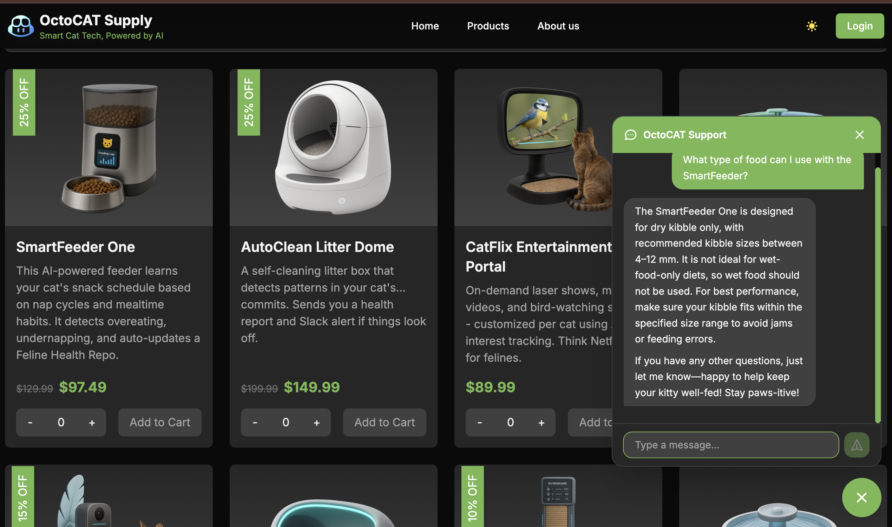

# Demo: Adding a Customer Support Chatbot with Microsoft Foundry + GitHub Copilot

This walkthrough shows how **Microsoft Foundry** and **GitHub Copilot** complement each other in a real-world scenario of embedding AI into an application.

A sample delivery video is available at [https://aka.ms/chatbot-sample-demo](https://aka.ms/chatbot-sample-demo).

> [!WARNING]
> This demo assumes familiarity with Microsoft Foundry and GitHub Copilot along with your own Azure subscription. Make sure to run the demo end-to-end at least once before presenting to ensure you understand the flow and have all the necessary access and resources set up. This also helps so you can swap to a pre-staged environment if you run into any unexpected issues during the live demo. 


## Overview

OctoCAT Supply wants to add a customer-facing support chatbot to its homepage. The chatbot should answer product questions, give recommendations, and handle policy queries using a curated knowledge base — no hallucinated discounts, no invented policies.

The demo has two acts:

| Act | Tool | What happens |
|-----|------|--------------|
| **1 — Build the brain** | Microsoft Foundry | Create an AI agent with a system prompt and grounding document |
| **2 — Build the UI** | GitHub Copilot (Plan → Agent) | Embed the agent into the React frontend as a chat widget |

**Estimated live demo time:** 15-20 minutes (Act 1 can be pre-staged if short on time).

---

## Prerequisites

- Access to an **Microsoft Foundry** project ([portal.azure.com](https://portal.azure.com) or [ai.azure.com](https://ai.azure.com)). You'll need `Owner` role in the Azure subscription to create the foundry resource and assign the `Azure AI User` role to yourself.

> [!TIP]
> **Microsoft employees** can use their internal AIRS subscription.
> 
> **GitHub employees** will need to use a personal Azure subscription such as one created via the [MSDN benefit](https://my.visualstudio.com/benefits) that all MSFT employees have access to. The shared Field Services Azure subscription will NOT work.

- **Azure CLI logged in** — before starting the demo, make sure you're authenticated in your VS Code terminal:

  ```bash
  az login
  ```

  This session is used by your local dev server or backend proxy (via `DefaultAzureCredential`) to authenticate with the Foundry agent endpoint. The browser-based frontend only calls that proxy, so you don't need to handle tokens manually.

- **(Optional) Copilot Cloud Agent Azure auth** — if you plan to use Copilot Cloud Agent in the demo, you will need to setup Azure credentials for the agent to call the Foundry endpoint. Update `.github/workflows/copilot-setup-steps.yml` to log in to the Azure CLI using the [`azure/login`](https://github.com/marketplace/actions/azure-login) action before the agent starts. You have two options:

  **Option 1 — Service principal with client secret:**

  Create an `AZURE_CREDENTIALS` repository secret containing a JSON object with your service principal details:
  ```json
  {
    "clientId": "<app-registration-client-id>",
    "clientSecret": "<client-secret-value>",
    "subscriptionId": "<azure-subscription-id>",
    "tenantId": "<azure-ad-tenant-id>"
  }
  ```
  Then add this step to `copilot-setup-steps.yml`:
  ```yaml
  - name: Azure CLI login
    uses: azure/login@v3
    with:
      creds: ${{ secrets.AZURE_CREDENTIALS }}
  ```

  **Option 2 — OIDC with federated credential (recommended):**

  This approach avoids storing long-lived secrets. You'll need a [user-assigned managed identity](https://learn.microsoft.com/entra/identity/managed-identities-azure-resources/manage-user-assigned-managed-identities-azure-portal?pivots=identity-mi-methods-azp#create-a-user-assigned-managed-identity) (or app registration) with a [federated credential that trusts your GitHub Actions workflow](https://learn.microsoft.com/entra/workload-id/workload-identity-federation-create-trust-user-assigned-managed-identity?pivots=identity-wif-mi-methods-azp#github-actions-deploying-azure-resources). When configuring the federated credential, set **Environment** to `copilot` — this is the environment Copilot Cloud Agent uses when running the setup steps workflow.

  Store the identity's `AZURE_CLIENT_ID`, `AZURE_TENANT_ID`, and `AZURE_SUBSCRIPTION_ID` as repository secrets, then add this step:
  ```yaml
  - name: Azure CLI login (OIDC)
    uses: azure/login@v3
    with:
      client-id: ${{ secrets.AZURE_CLIENT_ID }}
      tenant-id: ${{ secrets.AZURE_TENANT_ID }}
      subscription-id: ${{ secrets.AZURE_SUBSCRIPTION_ID }}
  ```
  You'll also need to add `id-token: write` to the job's `permissions` block for OIDC to work.

  Without this step, `DefaultAzureCredential` in the Cloud Agent environment won't have an active Azure session and calls to the Foundry endpoint will fail.

  > [!IMPORTANT]
  > Whichever option you choose, the identity (service principal or managed identity) must have the **`Azure AI User`** role assigned on the Foundry resource. Without this role, authentication will succeed but the agent API calls will return authorization errors.

## Resources

The grounding files live in the repo under `demo/resources/chatbot/`:

| File | Purpose |
|------|---------|
| `system-prompt.md` | Professional-tone system prompt with rules, escalation triggers, and response style |
| `system-prompt-casual.md` | On-brand variant with cat puns and a relaxed tone |
| `agent-grounding.md` | Full product catalog, specs, policies, FAQs, and recommendation logic for retrieval |

---

## Setting the Scene

Before diving into the build, show the audience the application as it exists today — no chatbot, no support widget.

1. **Install dependencies** (if not already done):

   ```bash
   make install
   ```

2. **Start the app** (if not already running):

   ```bash
   make dev
   ```

3. **Walk through the homepage** — show the basic homepage, product catalog, etc... 
4. **Click into a product** — highlight that customers can browse and see details, but there's no way to ask questions or get help without leaving the site.
5. **Set the stage**:

   > *"This is OctoCAT Supply today — a clean storefront, but if a customer has a question about compatibility, shipping, or returns, they have to dig through docs or email support. We're going to add an AI-powered support chatbot right here, and we'll do it in two steps: first we'll set up the AI agent in Microsoft Foundry, then we'll use GitHub Copilot to embed it into the frontend."*

---

## Act 1 — Build the Brain (Microsoft Foundry)

### Narrative

> *"Before we write any frontend code, we need an AI agent that actually knows our product catalog and policies. Microsoft Foundry lets us set that up with a system prompt and grounding document — no model training required. Think of Foundry as the brain and our React app as the face."*

### Steps

1. **Open Microsoft Foundry**
   - Navigate to [ai.azure.com](https://ai.azure.com) and login using your credentials.
   - Create a new project (or use an existing one). You'll need to specify your Azure subscription, resource group, name, and region. 



> [!NOTE]
> This step takes a few minutes, so it's a good time to explain what Foundry is and why we're using it. You could also have this pre-staged to save time and to avoid any capacity issues inside Azure. 

> [!NOTE]
> These instructions assume you are using the new Foundry experience. You can switch to the new experience by clicking the `New Foundry` toggle in the Foundry UI if you aren't already. The old experience (which may still be the default for some users) has a different flow for creating agents, but the same concepts apply.

> [!TIP]
> The `Azure AI User` role should be automatically assigned to you when creating the resource through the Foundry portal. If you run into access issues creating agents or using the playground, check **Access control (IAM)** on the Foundry resource in the **Azure portal** and verify this role is assigned to your account.

2. **Create a new Agent**
   - Click **Build** in the top nav bar
   - Click **Agents** in the left nav
   - Click **Create Agent** in the main pane
   - Give it a name: `OctoCAT-Support-Agent`.

3. **Select the model** — Choose your model. For our demo gpt-4.1 works great, but you can pick any model available in your Foundry instance.

4. **Add the System Prompt**
   - Open `demo/resources/chatbot/system-prompt.md` (or `system-prompt-casual.md` for the fun version) in VS Code.
   - Copy the content and paste it into the **Instructions** field in Foundry.

> [!NOTE]
> If you have extra time you can ask Copilot to write a new variant of the system prompt with a different tone or style. Both examples were generated by Copilot using the same set of rules, just different prompt engineering to achieve a different voice.

> [!TIP]
> You can later come back and tweak the system prompt if you want to show how changes affect the agent's behavior in real time.

5. **Add a lookup tool**
   - Under the **Tools** section, click **+ Add** → **Browse all Tools** → **File Search** → **Add tool**.
   - Upload `demo/resources/chatbot/agent-grounding.md` as the grounding file.
   - Explain: *"This document contains our full catalog — 12 products with specs, pricing, inventory status — plus shipping, returns, warranty, and FAQ policies. The agent retrieves from this at runtime instead of guessing."*

   

> [!NOTE]
> The document may take a minute to process. Wait for it to show `Success` before moving on.

   - Click **Attach** to save the tool configuration.

   - Your final agent setup should look like this:

   

6. **Test in the Foundry Playground**
   - Use the built-in chat playground to test a few queries:
     - *"What's the best product for a senior cat?"*
     - *"Do you offer free shipping?"*
     - *"My cat was injured by your product"* — should escalate to human support

   

   - Highlight how the agent stays grounded — no made-up products, no invented discounts.

7. **Save and Publish the Agent**
   - Once you're satisfied with the behavior, click **Save** and then **Publish** to make it available for API calls.


8. **Note the Agent endpoint**
   - Once published, make sure to copy the `Responses API endpoint` URL. You'll need this to connect the frontend chat widget to the agent.

> [!NOTE]
> For a live demo, you can pre-stage this agent ahead of time. The key demo beat is showing the playground test and the grounding document — the audience doesn't need to watch you click through Azure forms.

### Key Talking Points (Act 1)

- **Grounding prevents hallucination** — the agent retrieves from the document rather than generating answers from training data.
- **System prompt sets guardrails** — escalation rules, response style, and product recommendation limits are all declarative.
- **No code yet** — we configured an intelligent agent without writing a single line of application code.
- **Iterate in real time** — you can tweak the system prompt or grounding document and see changes immediately in the playground.
- **Foundry is extensible** — today we used a static file for grounding, but you could connect live databases, APIs, or other tools for dynamic retrieval. See [Production Considerations](#production-considerations) below for more info.

### Quick Recap Before Moving On

> *"Let's take a step back and recap what we just did. In about five minutes we stood up a fully functional AI agent — no model training, no data pipelines, no infrastructure code. We gave it three things: a model, a system prompt with behavioral rules, and a grounding document with our product catalog and policies. Foundry handles the retrieval, the guardrails, and the hosting. All we need from here is an endpoint URL to call."*
>
> *"Now, we used a static grounding document today because it's great for a demo — but in production you'd expand Foundry well beyond that. You could connect it directly to your live product catalog API so pricing and inventory are always current, integrate with your support knowledge base in Zendesk or ServiceNow, wire up order lookup and shipment tracking APIs, and use Foundry's tool-calling to let the agent orchestrate across all of those in a single conversation. The architecture scales — the starting point is just this simple."*
>
> *"Alright, let's go build the customer-facing side."*

---

## Act 2 — Build the UI (GitHub Copilot: Plan → Agent)

### Narrative

> *"Now we have an AI agent that knows our catalog and policies. Next, we need to put it in front of customers. Instead of hand-coding a chat widget, we'll use GitHub Copilot — first to plan the work, then to implement it with Agent mode. Watch how Plan mode structures the approach and Agent mode does the heavy lifting."*

### Choose Your Approach

Depending on how much time you have and what you want to highlight, pick one of three approaches:

| Approach | Time | Best for showing |
|----------|------|-----------------|
| **A — Plan + Issue + Cloud Agent** | ~15 min | Delegation and async workflows: plan, create an issue, hand off to Copilot Cloud Agent |
| **B — Plan + Agent mode** | ~10 min | Full IDE workflow: plan first, then implement live |
| **C — Agent mode only** | ~5-7 min | Speed: jump straight into implementation, skip the planning step |

> [!TIP]
> If you have time, Approach A is the most comprehensive and shows the full power of Copilot across synchronous and asynchronous workflows. Approach B is a good middle ground that still highlights Plan mode without needing to wait for async PRs. Approach C is best if you're tight on time or want to focus on the coding aspect. We'll show the basic prompts you would use in any of the scenarios.

> [!NOTE]
> Whatever approach you take, it is a good idea to have an already completed example on standby. That way you can use some cooking show magic to swap to your completed session if things runs too long or you run into an error. You can show a completed plan in VS Code and talk over the individual steps in the planning process just like normal. The same goes for the implementation session in either the IDE or using CCA.

### Step 1 — Plan Mode

1. **Open Copilot Chat** in VS Code and switch to **Plan** mode.
2. Enter the following prompt:

   ```
   I want to add a customer support chatbot widget to the OctoCAT Supply frontend.

   Requirements:
   - Floating chat bubble in the bottom-right corner of every page
   - Clicking it opens a chat panel with message history
   - Messages are sent to our Microsoft Foundry agent endpoint
   - The widget should match our existing Tailwind design system and support dark mode
   - Include a typing indicator while waiting for the agent response
   - The chat panel should have a close/minimize button

   The agent is already deployed in Microsoft Foundry at <insert endpoint URL here>. Auth should go through a backend proxy route that uses DefaultAzureCredential from @azure/identity with the token scope https://ai.azure.com/.default (this is the correct audience for Foundry application endpoints — NOT cognitiveservices.azure.com). The dev environment has an active az login session that DefaultAzureCredential will pick up.
   ```

> [!TIP]
> We're being specific about the auth setup since Copilot tends to get this wrong. It will eventually self-heal but this helps it get it right on the first try. We could also include a link to the relevant Azure docs or use the Azure MCP server to provide more detailed instructions if needed.

3. **Walk through the plan** Copilot generates:
   - Point out how it identifies the files to create and modify.
   - Highlight that it respects the existing architecture (component structure, Tailwind, dark mode).
   - Note the plan includes things like state management, API integration, and responsive layout.

4. **(Optional) Refine the plan** — You can answer any follow-up questions Copilot had to refine the plan before committing to implementation. You can also modify the plan directly if you want to add/remove steps or change the approach.

5. **(Optional) Create a GitHub issue** — if you want to show async handoff, you can ask Copilot to create a new issue in the repo with the plan details using the GitHub MCP server:

   ```
   This is a new feature request. Please create a GitHub issue in the repo with the implementation plan and steps outlined.
   ```

   - Copilot will generate an issue with the plan details. You can then assign it to Copilot or a 3rd party agent to implement asynchronously, or you can take the plan and implement it yourself in real time.


### Step 2 — Agent Mode Implementation

1. **Switch to Agent mode** in Copilot Chat.
2. Tell it to implement the plan:

   ```
   Implement the changes from the plan.
   ```

3. **Narrate as Copilot works** through the implementation. A few key points to highlight:
   - Copilot works like a developer would: it reads the existing codebase, identifies where to make changes, and generates code that fits the existing patterns, tests, and self-heals when it encounters errors.
   - You can easily review and adjust the generated code before accepting it, just like you would with a human PR.
   - Copilot automatically follows any custom instructions in the project.
   - You can browse the files as Copilot works and see the changes in real time.
   - Copilot may ask for permissions to run any shell commands (like installing new dependencies) — this is a great moment to highlight the trust and safety features built in.
   
4. **Review the generated code** together:
   - Show how Copilot followed project conventions (Tailwind, React patterns, dark mode toggle).
   - Check that it used the existing configuration patterns.
   - Accept or adjust changes as needed.

### Step 3 — Run and Demo the Result

1. **Start the frontend** (if not already running):

   ```bash
   make dev
   ```

2. **Show the chat widget in the browser**:
   - Navigate to the homepage — the chat bubble should appear in the bottom-right corner.
   - Click to open — show the chat panel with the input field.
   - Ask a product question. Here's an example: *"What type of food can I use with the PetFeeder?"*
   - Show the agent responding with grounded product recommendations.
   - Ask additional follow-up questions to demonstrate the conversational flow and grounding. For example: *"Can I exchange it if my cat doesn't like it?"* — the agent should cite the return policy from the grounding document.

A sample conversation might look like this:



---

## Key Talking Points (Full Demo)

| Theme | Message |
|-------|---------|
| **Foundry + Copilot = complementary** | Foundry provides the AI agent brain; Copilot provides the developer velocity to embed it. Different tools, one workflow. |
| **Grounding is the secret** | The agent's quality comes from the grounding document, not prompt tricks. Curated product data and policy rules prevent hallucination. |
| **Plan before you build** | Plan mode structures complex work before a line of code is written. It catches architectural decisions early. |
| **Convention-aware generation** | Copilot reads the existing codebase — Tailwind classes, dark mode, config patterns — and generates code that fits in. |
| **No new infrastructure for devs** | The frontend developer doesn't need to learn Azure ML pipelines. They get an endpoint URL and Copilot handles the SDK integration. |

---

## Production Considerations

This demo uses a static `agent-grounding.md` file as the knowledge source for simplicity. In a real production deployment, you would expand Foundry's capabilities significantly:

- **Live product catalog integration** — connect the agent to your product database or commerce API so pricing, inventory status, and new products are always current without manual document updates.
- **Support knowledge base** — integrate with existing tools like Zendesk, ServiceNow, or Confluence so the agent draws from the same articles your human support team uses.
- **Order and account APIs** — give the agent access to order lookup, shipment tracking, and account APIs (with proper auth scoping) so customers can ask *"Where's my order?"* and get a real answer.
- **Multi-tool orchestration** — Foundry supports tool/function calling, allowing the agent to query multiple backends in a single conversation (e.g., check inventory → calculate shipping → apply promo code).
- **Evaluation and monitoring** — use Foundry's built-in evaluation pipelines and Azure Monitor to measure answer quality, detect drift from grounding data, and flag conversations that should have escalated but didn't.

The static grounding document is a great starting point for prototyping and demos, but production agents should be wired into live data sources to stay accurate and reduce maintenance overhead.

---

## Troubleshooting

| Issue | Resolution |
|-------|-----------|
| Foundry playground returns generic answers | Check that the grounding document was uploaded as a knowledge source (File Search), not just pasted into the system prompt |
| Foundry agent not responding or returning auth errors | Verify your `az login` session is active and that the `Azure AI User` role is assigned on the Foundry resource. Re-run `az login` and try again — an expired or missing session is the most common cause |
