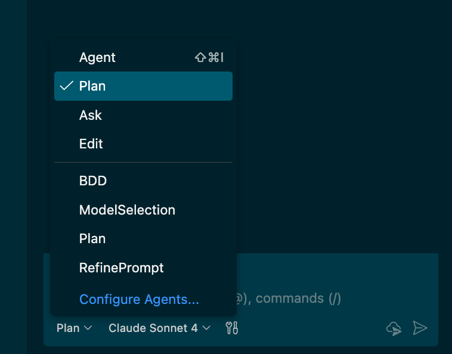
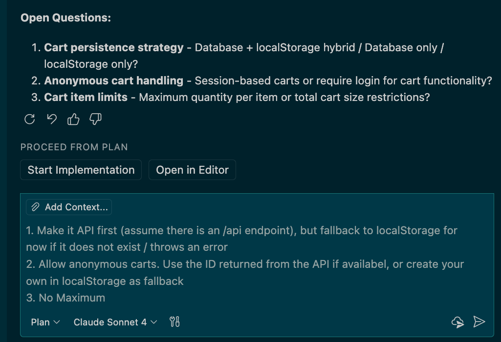
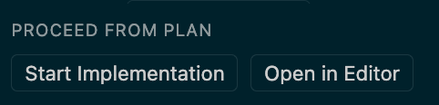

# Copilot in the IDE

> Note: For the most basic "What can Copilot do?" scenario, use the `demo-unit-test-coverage` prompt to have Agent Mode add some unit tests.

## General Copilot Features

### Demo: Enhancing Unit Tests and Coverage

#### Option 1: Using Coding Agent

If you want to demo Copilot Coding Agent, there is an Issue for improving Code Coverage on the repo - it should be Issue #2 (`Improve test coverage for API` - created as part of the demo spinup). Assign this to Copilot - that's it. This takes about 15 mins, so do this ahead of time if necessary!

> [!TIP]
> **Using 3rd Party Agents:** When assigning an issue to Copilot, you can open the **Web agents panel** or use the **Agent Picker** in VSCode to select an alternative agent such as **Claude** or **Codex** instead of the default Copilot Coding Agent. This allows you to leverage different agents for your coding tasks.

#### Option 2: Live Coding

- **What to show:** Copilot generating multiple tests, executing them, analyzing coverage and self-healing, plus demonstrate efficient use of custom prompts for testing workflows.
- **Why:** Show Copilot's ability to quickly and easily generate tests, validate them, self-heal and analyze coverage. Also demonstrate how custom prompts can standardize testing practices.
- **Approach 1 - Custom Prompt (Recommended for demos):**
  1. Open the [demo-unit-test-coverage.prompt.md](../../.github/prompts/demo-unit-test-coverage.prompt.md) file
  2. Show the prompt structure: pre-configured for Agent mode, comprehensive tool list, detailed testing requirements
  3. Explain how it includes specific coverage requirements, CRUD operations, error handling, etc.
  4. Click "Run" to execute the automated test generation
  5. Show how it creates comprehensive test files for both Product and Supplier routes
  6. Demonstrate the self-healing capabilities when tests fail

- **Approach 2 - Manual Chat (For deeper explanation):**
  1. Ask Copilot to `run tests, analyze coverage and add missing Branch tests to include tests for untested scenarios`
  2. Show Agent working on the tests and adding new tests for the API Branch route
  3. Show Copilot "self-healing" (if tests fail)
  4. Accept the changes
  5. Ask Copilot to `add tests for the Product route` to show generation of new tests

- **Key Takeaway**: Custom prompts can encapsulate testing best practices and ensure comprehensive coverage automatically.

#### Option 3: Copilot CLI

Before you start check the issue number for `Improve test coverage for API`.

> [!TIP]
> **Open Copilot CLI in VS Code:** There are several ways to start Copilot CLI. From VS Code you can start by selecting New Copilot CLI Session from the New Chat menu in Copilot Chat. You can also open a Terminal in the Editor View using `Command + Shift + P` and then `Terminal: Create New Terminal in Editor Area` or drag a terminal window into the edit area. From VS Code you can run Copilot CLI commands while still having access to your workspace and the ability to quickly open files that Copilot CLI generates or modifies or to view the Copilot CLI sessions in Copilot Chat. You can hide the Workspace Explorer and Copilot Chat if you want a cleaner workspace.

- **What to show:** Using Copilot CLI to generate tests and analyze coverage directly from the terminal using parallel tasks.
- **Why:** Demonstrate that Copilot's capabilities are not limited to the IDE and can be accessed from the command line for quick iterations and automation.
- **How:**
  1. In the terminal open copilot with `copilot --yolo`. This auto-approves tool calls and terminal commands. You can also go into auto-approve mode using the `/yolo` command.
  2. Type `?` and share a few key commands like cycle modes, model selection, editing, fleet mode, tasks and session information.
  3. Shift to plan mode (`Shift + TAB`) and type `Write an implementation plan for #\<issue-number\>`.
  4. Once that is done, select `2. Exit plan mode and I will prompt myself`.
  5. Open the plan and share its contents (`Command + Click` to open). You can see that when you use Copilot CLI in VS Code you have easy access to files.
  6. Shift to autopilot (`Shift + TAB`) and type `/fleet implement the plan` Share that `autopilot` mode completes tasks without needing your input after the initial instruction and that `/fleet` enables parallel subagent execution.
  7. Wait for Copilot to get started on the tasks and then type `/tasks` to show how Copilot runs multiple tasks in the background using subagents. Scroll to one of the tasks and then type `Enter` to open the Subagent Details view. Go back with `Escape`.
  8. The tasks take some time to complete, so it is best to continue with other demos and then revisit this demo later.
  9. Once you revisit, type `/session` to view the session details. If you want to run another task, type `/model` and select a different model (for example the latest GPT or Gemini model) and then type `/review` to review the changes. Have it fix any suggestions.

- **Key Takeaway**: Copilot CLI provides a powerful way to interact with Copilot's capabilities directly from the terminal, enabling quick iterations and parallel task execution. Running the CLI from VS Code allows you to easily access generated files and maintain context with your workspace.

### Demo: Using Vision and Agent to Generate Cart Functionality

> [!NOTE]
> **Quick Start Option**: Use the `demo-cart-page.prompt.md` custom prompt for an automated demo. This prompt will have Agent Mode implement the complete Cart Page functionality automatically with proper context and tools pre-configured.

- **What to show:** "Vibe coding" using Agent Mode and Vision to complete complex tasks, plus demonstrate custom prompt efficiency.
- **Why:** Demonstrate how Copilot Vision can detect design patterns, how Agent can understand a codebase and create complex changes over multiple files, and how custom prompts can streamline complex demos.

#### Approach 1 - Custom Prompt (Recommended for demos)

  1. Open the [demo-cart-page.prompt.md](../../.github/prompts/demo-cart-page.prompt.md) file
  2. Show the prompt structure: comprehensive tool list, detailed context about the current state
  3. Attach the [cart image](../docs/design/cart.png) to the prompt
  4. Click "Run" to execute the entire cart implementation automatically
  5. Show how the custom prompt handles the complete workflow with proper context

#### Approach 2 - Manual Chat (For deeper explanation)

  1. Run the App to show the original code. Once the site starts, click on "Products" in the NavBar and show the Product Page. Add an item to the Cart - note that nothing actually happens, except a message saying, "Added to Cart". Explain that there is no Cart in the frontend app currently.
  2. Open Copilot and switch to "Plan" mode.
  3. Attach the [cart image](../docs/design/cart.png) using the paperclip icon or drag/drop to add it to the chat.
  4. Enter the following prompt:

    ```txt
    I need to implement a simple Cart Page. I also want a Cart icon in the NavBar that shows the number of items in the Cart.
    ```

  5. Highlight that Copilot has suggested changes and planned the components to add/modify.
  6. (OPTIONAL if you have the GitHub MCP Server configured): Ask Copilot to `create an issue in my repo to implement the Cart page and Cart icon`
  7. Show the issue in the repo
  8. Switch to "Agent" mode in Copilot Chat. Switch to `Claude 3.5 Sonnet` (a good implementation model) and enter this prompt:

    ```txt
    Implement the changes.
    ```

  9. Show Copilot's changes and how you can see each one and Keep/reject each one.
  10. Accept Copilot's suggested fixes.
  11. Go back to the Frontend app. Navigate to Products. Show adding items to the cart (note the icon updating). Click on the Cart icon to navigate to the Cart page. Show the total, and adding/removing items from the cart.

- **Key Takeaway**: Custom prompts provide consistency and can encapsulate complex workflows that would otherwise require multiple manual steps.

## Customizations

### Demo: Custom Prompt Files and standardized AI-Workflows

- **What to show:** Reusing custom prompts to streamline AI-native workflows and demonstrate prompt engineering best practices
- **Why:** Demonstrate how Copilot and VSCode use custom prompts to help streamline AI-native workflows, keep developers in the flow, and provide consistent, repeatable results.
- **How:**  
  1. **Quick Demo Prompts**: Show the available demo prompts in the `.github/prompts/` directory:
     - `demo-cart-page.prompt.md` - Complete cart implementation with vision
     - `demo-unit-test-coverage.prompt.md` - Automated test generation and coverage analysis
  2. **Custom Chat Modes**: Show `Plan` and `BDD` modes - each outlined below.
  3. **Live Demo**: Run one of the demo prompts (e.g., `demo-unit-test-coverage.prompt.md`) to show Agent mode automatically executing a complex workflow.
  4. **Note:** Explain that custom prompts provide consistency, reduce cognitive load, and can be shared across teams for standardized workflows.

### Demo: Custom Instructions and Repository Configuration

- **What to show:** Copilot's **Custom Instructions** feature using the existing `.github/copilot-instructions.md` configuration.
- **Why:** Demonstrate that Copilot can be customized and personalized for internal libraries, coding standards, and team practices that don't exist in the foundational models.
- **How:**  
  1. Show the existing [.github/copilot-instructions.md](../../.github/copilot-instructions.md) file in the repository
  2. Explain how this file provides context about:
     - Repository information (owner, repo name)
     - Architecture references
     - Build and testing instructions
  3. **Demo Enhanced Custom Instructions**:
      1. Option 1: Apply the Patch Set `Copilot: Custom Instructions`[^1] which will update the custom-insturctions file
      2. Option 2: Update the custom instructions file by hand, adding these additional guidelines

          ```markdown
          ## Additional Guidelines for REST APIs
          
          For REST APIs, use the following guidelines:
          
          * Use descriptive naming
          * Add Swagger docs for all API methods
          * Implement logging and monitoring using [TAO](../docs/tao.md)
            - assume TAO is installed and never add the package
          ```

  4. Show the [TAO](./tao.md) documentation to demonstrate the fictional internal library
  5. Ask Copilot to `add observability to the Supplier route using our internal standards`
  6. Show how Copilot uses the custom instructions to implement TAO observability patterns
  7. **Note**: Explain that this will not compile since TAO doesn't really exist - this demonstrates how custom instructions can reference internal frameworks
  8. **Key Takeaway**: Custom instructions allow teams to encode their specific practices, internal libraries, and coding standards

### Demo: Review files for compliance with 3p Web Interface Guidelines using agent skills

- **What to show:** Copilot's ability to review code for specific web accessibility guidelines using the Web Interface Guidelines agent skill
- **Why:** Demonstrate that Copilot can be used to enforce best practices and guidelines, such as web accessibility standards using 3p [agent skills](https://agentskills.io/home), an open standard for custom instructions
- **How:**  
  1. In the terminal run the following command `npx skills add vercel-labs/agent-skills --skill web-design-guidelines -a github-copilot` to add the Web Interface Guidelines skill to the repository.
  2. Open the `SKILL.md` and explain that this skill provides guidelines for accessibility, typography and other web design best practices. It fetches the latest guidelines from GitHub. For all guidelines see the [Web Interface Guidelines Documentation](https://raw.githubusercontent.com/vercel-labs/web-interface-guidelines/main/command.md)
  3. Ask Copilot to `Review the UI`
  4. Show how Copilot reads the skill, fetches the guidelines and reviews the code
  5. Once review is complete, share some findings and optionally ask Copilot to fix some issues
  6. **Key Takeaway**: Copilot supports 3p agent skills to customize Copilot Chat

## Security

### Demo: Copilot and Application Security

- **What to show:** Copilot's ability to understand and remediate security vulnerabilities
- **Why:** Demonstrate that Copilot can be used to scale AppSec by bringing security expertise to Developers directly.
- **How:**  
  1. Open Copilot Chat and switch to `Ask` mode.
  2. Ask Copilot to `analyze @workspace and check if there are obvious security vulnerabilities`
  3. You should see issues like:
      - Cross-site Scripting (XSS) vulnerability
      - Command Injection Vulnerability
      - Insecure CORS Configuration
      - Missing Security Headers
      - Insecure Authentication Implementation
  4. Chat with Copilot to address one of these issues: `generate a fix for ...`
  5. (Optional with GitHub MCP Server): Ask Copilot to `create an issue to fix ...` and select a vulnerability for Copilot to create an Issue

## CI/CD

### Demo: Automating Deployment with GitHub Actions, Azure and Bicep

- **What to show:** Copilot generating Actions workflows and Infrastructure-as-code.
- **Why:** Show Copilot's ability to automate CI/CD workflows.
- **How:**
  1. Ensure that you have run the [configure-deployment.sh](../infra/configure-deployment.sh) script to set up the initial infrastructure and configure the environments and vars in the repo.
  2. Add the [deployment.md](../docs/deployment.md) file as context.
  3. Prompt Copilot Agent to `generate bicep files and workflows according to the deployment plan`
  4. Show generated files:
     - GitHub Actions YAML to build & test
     - GitHub Actions YAML to deploy including an approval step
  5. Accept the changes
  6. Commit and push to see the pipeline execution
  7. Show the deployment

## TDD Agent Mode

### Demo: Custom Agents Driving a Multi-Phase Workflow

- **What to show:** Three custom agents (`tdd-red`, `tdd-green`, `tdd-blue`) that each own one phase of a TDD workflow, demonstrating how custom agents can enforce role-specific constraints and hand off context between phases.
- **Why:** TDD is a familiar, well-structured process that makes it easy to show how custom agents can be scoped to a single responsibility, how the developer orchestrates handoffs between them, and how each agent's prompt constrains what it will and won't do.
- **How:**

  1. **Plan the Feature (Plan Mode):**
     - In VSCode, open Copilot Chat and switch to **Plan** mode (or use `/plan` in the CLI)
     - Enter the prompt: `I want a new method that gets the orders for a branch ID`
     - Walk through the planning conversation — Copilot will ask clarifying questions and produce a structured plan
     - Once satisfied, keep the plan open — it serves as input for the agents in the next phases

     > [!TIP]
     > See the [Planning Mode in VSCode](#planning-mode-in-vscode-copilot-) section below for a detailed walkthrough of Plan mode.

  2. **🔴 Red Phase — `tdd-red` Agent:**
     - Switch to the `tdd-red` agent from the agents dropdown
     - Prompt it with a single requirement from the plan, e.g.: `Write a failing test for getting orders by branch ID`
     - Show how the agent is **constrained by its prompt** — it writes a test but refuses to write implementation code
     - Show the test output confirming the test fails (e.g., HTTP 404 — route not implemented)

  3. **🟢 Green Phase — `tdd-green` Agent:**
     - Switch to the `tdd-green` agent
     - Prompt: `Make the failing test pass`
     - Show how this agent's scope is different — it reads existing tests and writes only enough implementation to make them pass
     - Show the test passing ✅

  4. **🔵 Blue Phase — `tdd-blue` Agent:**
     - Switch to the `tdd-blue` agent
     - Prompt: `Refactor the implementation while keeping tests green`
     - Show how this agent focuses on code quality — refactoring, naming, documentation — while continuously running tests to prevent regressions

  5. **Repeat the Cycle:**
     - Go back to `tdd-red` for the next requirement from the plan
     - Cycle through Red → Green → Blue to show how agents hand off context through the code itself (tests, implementation, plan)

  6. **Key Points to Highlight:**
     - **Role-Scoped Agents**: Each agent has strict boundaries — Red won't implement, Green won't refactor, Blue won't add features
     - **Developer-Driven Orchestration**: The developer decides when to switch agents — there's no magic; the workflow is transparent
     - **Context Through Code**: Agents hand off context via the artifacts they produce (tests, implementation, plan doc) — not hidden state
     - **Prompt Engineering in Practice**: Open `.github/agents/` to show how each agent's prompt enforces its role and constraints
     - **Reusable Pattern**: This same multi-agent pattern applies to any phased workflow (e.g., design → implement → review)

  7. **(Optional) Show the Agent Configuration:**
     - Open `.github/agents/` to show the three TDD agents and their prompt files:
       - `tdd-red.agent.md`: Scoped to writing failing tests only
       - `tdd-green.agent.md`: Scoped to minimal implementation
       - `tdd-blue.agent.md`: Scoped to refactoring with tests green
     - Highlight how each agent's system prompt is what enforces the constraints you just saw in action

- **Key Takeaway**: Custom agents let teams encode multi-phase workflows where each agent owns a clear responsibility. The TDD cycle is a great example — but the pattern generalizes to any process where you want role-specific AI behavior with transparent handoffs.

## Planning Mode in VSCode :copilot: 📝

1. Open the demo repository in **VSCode**.
2. Open Copilot Chat and switch to `Plan` Mode.
  
    

3. Use the following prompt to kick off a planning session:

    ```txt
    I need to implement a cart feature in this application. Help me plan that.
    ```

4. Copilot will first retrieve some information and then come back to you with some questions (CAUTION: They might not be exactly the same as below, so just get creative):

    

5. Answer the questions accordingly. Copilot might come back with more questions. You can decide whether to keep answering them or, at some point, turn the plan into action.

6. Choose one of the following actions:
    
    1. Click `Start Implementation` to have Agent Mode implement the plan right away.
    2. Click `Open in Editor` to store the plan in a markdown file.
    3. Switch to `Agent` Mode and prompt Copilot to hand this over to the Coding Agent (requires MCP to be started):

        ```txt
        Can you hand this plan over to coding agent?
        ```

---------

[^1]: To learn how to apply a patch-set, see [patch-sets.md](../general/patch-sets.md)
